[](https://t.me/magicaleks)


### 🐍 Python — my native language. Production runs on it, and so do I.

```python

class BackendEngineer:

    def __init__(self):
        self.name = "Aleks Zenitsin"
        self.role = "Backend engineer"
        self.language_spoken = ["ru_RU", "en_US"]

    def say_hi(self):
        print("Thanks for dropping by, hope you find some of my work interesting.")


me = BackendEngineer()
me.say_hi()
```

### ⛓️ Solidity — wrote a DeFi protocol, survived.

```solidity

contract BlockchainDeveloper {

    string constant myDevTag = "@magicaleks";
    string constant deFiProject = "Ruble stablecoin";
    bool constant isOpenForFunding = true;

    function contactWithMe() external payable returns (string memory) {
        return "Check my profile and contact me with your favourite messenger!";
    }
}
```

### 🐹 Go — goroutines at 3am. Zero regrets.

```go

package main

import (
	"fmt"
	"sync"
)

func deploy(service string, wg *sync.WaitGroup) {
	defer wg.Done()
	fmt.Printf("🟢 service/%s is up\n", service)
}

func main() {
	services := []string{"api-gateway", "auth", "payments", "notifications"}
	var wg sync.WaitGroup

	for _, svc := range services {
		wg.Add(1)
		go deploy(svc, &wg)
	}

	wg.Wait()
	fmt.Println("🚀 All systems operational")
}
```

### ☕ Java — enough to be dangerous. Mostly to myself.

```java

import java.util.List;

void main() {
    record Skill(String name, int years) {}

    var stack = List.of(
        new Skill("Python", 4),
        new Skill("Go",     2),
        new Skill("Java",   3)
    );

    stack.stream()
        .filter(s -> s.years() >= 2)
        .sorted((a, b) -> b.years() - a.years())
        .map(s -> "⭐ %-8s %dy".formatted(s.name(), s.years()))
        .forEach(System.out::println);
}
```

## 🔧 Technologies & Tools


## 📊 GitHub Stats




